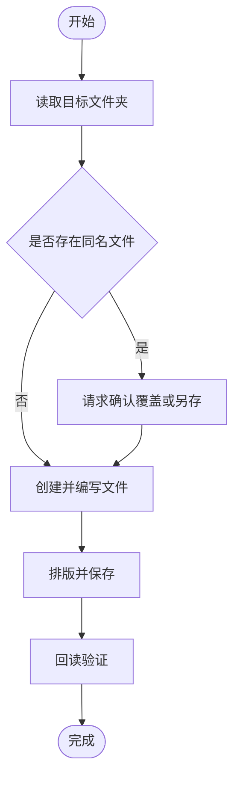

# ComputerUse 文件编写助手

## 目标

把“在文件夹里完成一份文件”当成一个可验收的工作流：确认目标 → 检查目录 → 规划内容 → 编写 → 排版或生成流程图 → 保存 → 回读验证。ComputerUse MCP 负责可视化操作和应用状态，文件工具负责长文本与精确内容，二者配合使用。

## 选择执行方式

- **文本、Markdown、JSON、代码、CSV**：优先用 `write_file` 或 `edit_file` 保证内容准确；用户要求“打开应用操作”时，再用 ComputerUse 打开文件并截图确认。
- **DOCX、PPTX、XLSX、Pages、Keynote、Draw.io**：使用对应应用的可视化界面完成格式、图形和保存，不要把二进制文件当纯文本改写。
- **流程图**：用户只需要可编辑文本时，在 Markdown 中生成 Mermaid；用户需要图形文件时，使用可用的流程图或演示应用绘制并保存；不确定时同时保存 Mermaid 源文件和可视化导出文件。
- **网页或浏览器编辑器**：优先使用浏览器 MCP 的结构化能力；只有需要桌面级点击、原生弹窗或不可访问的控件时，使用 ComputerUse。

## 标准工作流

### 1. 确认目标

确认以下信息：目标文件夹、文件名、格式、内容主题、是否需要流程图、是否覆盖已有文件、最终保存位置。用户只给了文件夹时，先列目录并根据上下文拟定文件名；只有存在多个合理方案时才提一个简短问题。

任务超过三步时先用 `todo_write` 建立清单，并在“编写、排版、流程图、保存、验证”完成后逐项更新。

### 2. 检查文件夹和现有文件

先用 `list_dir` 或 `glob_files` 检查目标目录；需要修改已有文件时先 `read_file`，保留原文件结构和用户已有内容。默认创建新文件，不覆盖同名文件；覆盖、删除或移动文件必须明确请求并等待工具授权。

如果要使用 GUI，按以下顺序调用 ComputerUse MCP：

1. `mcp__ComputerUse__get_screen_size` 或 `mcp__ComputerUse__get_displays` 确认坐标空间。
2. `mcp__ComputerUse__screenshot` 读取当前界面。
3. `mcp__ComputerUse__focus_app` 聚焦目标应用。
4. 每次点击、输入或快捷键前，都根据最新截图重新判断位置；不要复用过期坐标。

### 3. 先形成内容，再操作界面

先确定标题、章节、正文、列表、表格和流程图节点，再写入文件或应用。长文本使用 ComputerUse 的 `type` 一次输入一个完整段落或合理分块，不要模拟逐字点击；输入完成后读取或截图确认焦点和内容没有跑到错误控件。

文档默认结构：标题 → 摘要或目的 → 正文分节 → 流程图 → 注意事项或下一步。用户没有要求时，不擅自添加封面、署名、日期或营销文案。

### 4. 排版和流程图

- Office 文档优先使用标题样式、正文样式、项目符号和表格工具，不要用大量空格或空行模拟排版。
- 保持原文件已有的字体、标题层级、缩进、页边距和表格结构；用户指定格式时，以用户指定为准。
- Mermaid 流程图至少包含开始、关键动作、判断分支和结束；节点文字短而明确，分支标注“是/否”或实际条件。
- 图形流程图完成后检查节点是否重叠、连线是否指向正确、文字是否被裁切；必要时先保存可编辑源文件，再导出 PNG/PDF。

示例 Mermaid 结构：

### 5. 保存

保存前再次确认目标路径和文件名。GUI 的“另存为”对话框中，优先使用 `command+shift+g` 输入绝对路径，避免依赖侧边栏和坐标猜测；随后选择正确格式并保存。不要在未保存的情况下关闭编辑器或切换到破坏性操作。

### 6. 回读验证

保存后必须验证：

- 用 `list_dir`、`glob_files` 或 `read_file` 确认目标文件存在、非空、路径和扩展名正确。
- 文本类文件回读关键标题、流程图代码和结尾内容，确认没有截断或乱码。
- GUI 文件重新截图或重新打开，确认标题、正文、流程图、分页和保存状态正确。
- 发现验证失败时，说明具体失败点并修复；未验证成功前不要说“已完成”。

## ComputerUse 安全规则

- 每次 GUI 操作前先截图；窗口变化、弹窗出现、保存完成后重新截图。
- 不凭记忆使用坐标，不把 Dock、菜单栏或光标覆盖层当作目标控件。
- `click` 命中后要观察结果；无变化时先重新截图、确认焦点，再重试一次，不要盲目连续点击。
- 发送、删除、覆盖、关闭未保存窗口、退出应用等动作必须取得用户明确确认；危险快捷键使用 MCP 的确认参数。
- 保存失败、权限不足、应用未响应或路径不确定时，停止后续破坏性操作，报告实际错误和下一步选择。

## 完成汇报

用简洁结果汇报：创建或修改了什么、实际保存路径、使用的格式、流程图保存在哪里、验证是否通过，以及任何未完成项。不要只说“已经处理好了”。
